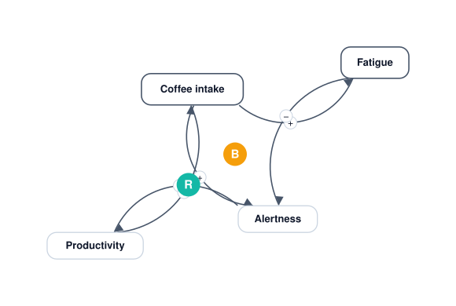

# neoloopy for Obsidian

Build **causal-loop diagrams (CLDs)** for systems thinking directly in your
vault. Variables are Markdown notes, links are causal arrows with polarity, and
neoloopy finds the **reinforcing (R)** and **balancing (B)** feedback loops in
your model — all stored as plain files you own.



<sub>Diagram preview of a model (reinforcing + balancing loops). A screenshot of
the live in-Obsidian canvas will replace this for the store listing.</sub>

- **Local-first and offline.** Each model is a folder of Markdown notes plus a
  small `model.json` manifest. No account, no server, nothing leaves your
  machine. The files *are* the source of truth and stay Obsidian-readable.
- **Interactive canvas.** Pan/zoom, drag nodes, draw and edit links, flip
  polarity, mark delays / indirect (dashed) / nonlinear links, and auto-tidy the
  layout. Detected loops are labelled R1/B1… right on the diagram.
- **Live edits.** Change a note (or let an agent edit the vault) and the canvas
  updates instantly, flashing what changed.
- **System insight & navigation.** A side panel surfaces detected loops and
  structure, lets you open each model's **System note**, and — when a model is
  referenced as a subsystem — lists its **parent systems** so you can jump up and
  recentre on the linking variable.
- **Export** to JSON, Markdown, or Mermaid.

## Install

From Obsidian: **Settings → Community plugins → Browse → "neoloopy"**, then
Enable. (During review/manual install, copy `main.js`, `manifest.json`, and
`styles.css` into `<vault>/.obsidian/plugins/neoloopy/`.)

Open the canvas from the ribbon (the fork icon) or the command **"neoloopy: Open
neoloopy canvas"**, then create a model and start adding variables.

## Privacy — fully local, offline

**This plugin never touches the network and spawns no external process.**
Everything runs in pure TypeScript on-device; your models stay in your vault.

Quantitative System Dynamics *simulation* is not part of this plugin (it lives in
the neoloopy app/CLI). Quantitative models are still **viewable** here, read-only:
equations, units, initial values, observed-series counts, and reference-mode
sparklines. The insight panel's "what-if" is a qualitative impact trace over your
causal graph — no simulator, no network.

## Open source

This plugin is open source under the [MIT License](LICENSE). All shipped code is
readable TypeScript — no bundled binaries, no obfuscation, no network calls.

## Development

```bash
npm install
npm run dev        # esbuild watch → main.js
npm run build      # typecheck + production bundle
npm test           # vitest (engine, codec, loop detection, geometry, Dart parity)
```

The engine is split into pure, dependency-free modules (`src/engine`, `src/view`
math) that are unit-tested without Obsidian, plus thin Obsidian adapters. Parity
tests under `test/` round-trip fixtures produced by the real Dart `neoloopy`
binary to guarantee the on-disk format stays byte-compatible across tools.
