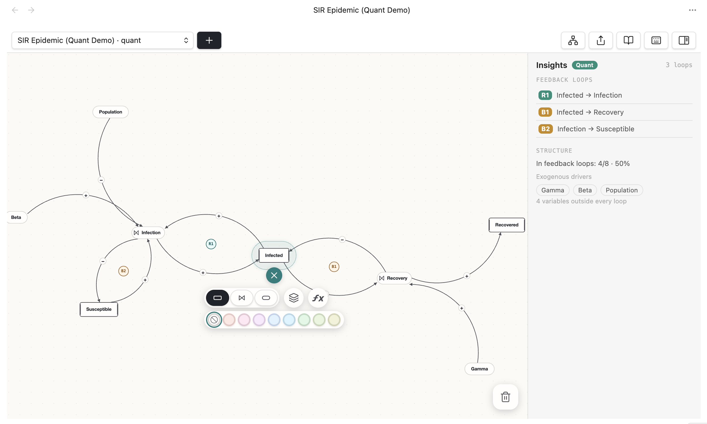
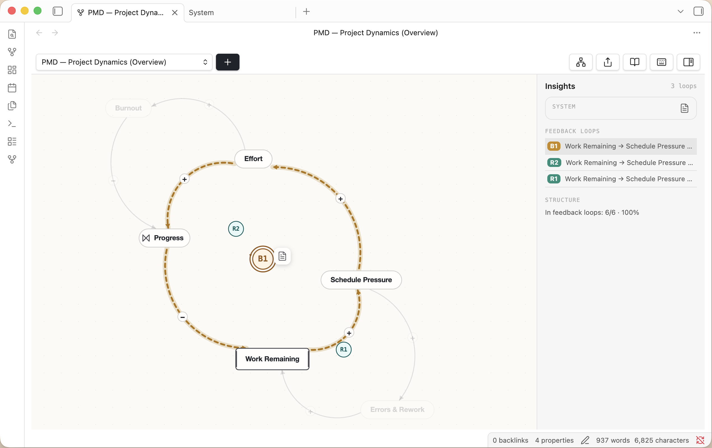

# neoloopy for Obsidian

[](https://github.com/frozenabe/neoloopy-obsidian/releases/latest)
[](https://github.com/frozenabe/neoloopy-obsidian/releases)
[](LICENSE)


> **Think in systems, not lists.** neoloopy turns your vault into a
> **causal-loop diagramming** tool: map how variables push and pull on each
> other, and let the plugin find the **reinforcing** and **balancing** feedback
> loops that drive the system's behaviour — all stored as plain Markdown you own.



<sub>A real capture of the neoloopy canvas inside Obsidian — an SIR epidemic model with the link-editing toolbar open.</sub>

## Contents

- [What it does](#what-it-does)
- [Why causal-loop diagrams?](#why-causal-loop-diagrams)
- [Features](#features)
- [Installation](#installation)
- [Getting started](#getting-started)
- [Commands](#commands)
- [Settings](#settings)
- [Works with the neoloopy app & CLI](#works-with-the-neoloopy-app--cli)
- [Privacy — fully local, offline](#privacy--fully-local-offline)
- [About quantitative models](#about-quantitative-models)
- [Support](#support)
- [Development](#development)
- [License](#license)

## What it does

neoloopy is a [systems-thinking](https://en.wikipedia.org/wiki/Systems_thinking)
modelling tool that lives inside Obsidian. You build a **causal-loop diagram
(CLD)** by adding **variables** (each is a Markdown note) and connecting them
with **causal links** that carry a polarity:

- **`+` (same direction)** — when the cause goes up, the effect goes up.
- **`−` (opposite direction)** — when the cause goes up, the effect goes down.

From that structure, neoloopy detects every **feedback loop** and labels it as
**reinforcing (R)** — a loop that amplifies change, like a vicious or virtuous
cycle — or **balancing (B)** — a loop that resists change and seeks an
equilibrium. The loops are drawn right on the canvas (R1, B1, …) so the system's
dynamics become visible at a glance.

Because every variable is a note and every model is just a folder of Markdown
plus a small `model.json` manifest, your models are searchable, linkable,
version-controllable, and **yours** — no database, no account, no lock-in.

## Why causal-loop diagrams?

Lists and outlines capture *what* you know; causal-loop diagrams capture *how it
behaves over time*. They're the standard notation in system dynamics for
reasoning about delays, unintended consequences, and leverage points — useful
for anything with feedback: product growth, team dynamics, ecology, economics,
personal habits, epidemics. neoloopy keeps that modelling where the rest of your
thinking already lives.

## Features



<sub>A project-dynamics model (effort, schedule pressure, rework, burnout) with detected R/B loops and the insight panel open.</sub>

- 🗂️ **Local-first and offline.** Each model is a folder of Markdown notes plus
  a small `model.json` manifest. No account, no server, nothing leaves your
  machine — the files *are* the source of truth and stay Obsidian-readable.
- 🎛️ **Interactive canvas.** Pan and zoom, drag nodes, draw and edit links, flip
  polarity, and mark links as **delayed**, **indirect** (dashed), or
  **nonlinear**. One command auto-tidies the layout.
- 🔁 **Automatic loop detection.** Reinforcing (R) and balancing (B) feedback
  loops are found for you and labelled R1/B1… directly on the diagram.
  Declared loops remain complete in SFD when their path resolves, with material
  closures highlighted as stock-flow pipes. Executable quantitative-only loops
  also appear when their complete path resolves; CLD projects each material
  effect as a causal link.
- ⚡ **Live edits.** Change a note in another pane — or let an AI agent edit the
  vault — and the canvas updates instantly, flashing exactly what changed.
- 🧭 **System insight & navigation.** A side panel surfaces detected loops and
  structure, opens each model's **System note**, and — when a model is
  referenced as a subsystem — lists its **parent systems** so you can jump up and
  recentre on the linking variable.
- 📤 **Export** a model to **JSON**, **Markdown**, or **Mermaid** with one
  command.
- 🖥️📱 **Desktop and mobile.** Pure on-device TypeScript. The plugin works in
  Obsidian desktop and mobile (`isDesktopOnly: false`), with current mobile
  support validated through the WebKit harness used for the iOS touch path.

## Installation

### From the Community Plugins store (recommended)

1. Open **Settings → Community plugins** and make sure Restricted/Safe mode is
   off.
2. Click **Browse**, search for **"neoloopy"**, and choose **Install**.
3. Click **Enable**.

### Manually

1. Download `main.js`, `manifest.json`, and `styles.css` from the
   [latest release](https://github.com/frozenabe/neoloopy-obsidian/releases/latest).
2. Copy them into `<your-vault>/.obsidian/plugins/neoloopy/`.
3. Reload Obsidian, then enable **neoloopy** under **Settings → Community
   plugins**.

> Release assets are built by GitHub Actions and ship with a signed
> build-provenance attestation, so you can verify they were built from this
> source:
> `gh attest verify --repo frozenabe/neoloopy-obsidian main.js`.

### Beta versions via BRAT

Prefer to test pre-release builds? Install the
[BRAT](https://github.com/TfTHacker/obsidian42-brat) plugin, then **Add beta
plugin** with the repository `frozenabe/neoloopy-obsidian`.

## Getting started

1. Open the canvas from the **fork icon** in the left ribbon, or run the command
   **"neoloopy: Open canvas"** from the command palette (`Ctrl/Cmd-P`).
2. Run **"neoloopy: Create new model"** (or the **+** in the canvas header) and
   type a title when prompted to start a model. Rename it any time with the
   **pencil** button next to the model picker, or **"neoloopy: Rename model"**.
3. Add a variable, then drag from one variable to another to draw a causal link
   and pick its polarity.
4. Build out the structure — neoloopy highlights the **R** and **B** loops as
   they form.
5. Open the **insight panel** to read the detected loops, jump between models,
   and open each model's System note.

Already have a vault from the neoloopy app or CLI? Use **Open folder as vault**
on that folder and the plugin finds every model automatically — it scans the
whole vault for `model.json`, and they're the same Markdown files on disk, so
there's nothing to sync. The reverse works too: point the `neoloopy` CLI at your
existing Obsidian vault folder.

## Commands

All commands are available from the command palette under the **neoloopy:**
prefix. Commands marked *(canvas)* act on the model in the active canvas.

| Command | What it does |
| --- | --- |
| **Open canvas** | Open or focus the neoloopy canvas. |
| **Create new model** | Prompt for a title, then start a new model in your default model folder. |
| **Rename model** *(canvas)* | Change the current model's title. |
| **Add variable** *(canvas)* | Add a variable to the current model. |
| **Tidy layout** *(canvas)* | Auto-arrange the nodes. |
| **Detect feedback loops** *(canvas)* | Report the reinforcing/balancing loops. |
| **Export model as Markdown** *(canvas)* | Export to Markdown (with a Mermaid diagram). |
| **Export model as JSON** *(canvas)* | Export the model structure as JSON. |
| **Export model as Mermaid** *(canvas)* | Export a Mermaid diagram. |

## Settings

| Setting | Default | Description |
| --- | --- | --- |
| **Default model folder** | `neoloopy` | New models are created as subfolders here. |
| **Live-edit spotlight** | On | Flash nodes/edges that change outside the canvas (e.g. edited in a note or by an agent). |

## Works with the neoloopy app & CLI

neoloopy's on-disk format is shared across tools. Models created here open in the
neoloopy app or `neoloopy` CLI and vice versa, with no import/export step —
they're the same Markdown notes and `model.json` manifest on disk. Parity tests
in this repo round-trip fixtures produced by the reference `neoloopy` binary to
guarantee the format stays byte-compatible.

## Privacy — fully local, offline

**This plugin never touches the network and spawns no external process.**
Everything runs in pure TypeScript on-device; your models stay in your vault.
There's no telemetry, no account, and no cloud component.

## About quantitative models

Quantitative System Dynamics *simulation* is not part of this plugin (it lives in
the neoloopy app/CLI). Quantitative models are still viewable and lightly
**editable** here without a simulator: in the **ƒx** modal you can edit a node's
equation (or a stock's initial value) and its units, written straight back to the
vault note. The plugin statically resolves complete executable feedback paths
from equations and first-class stock-flow endpoints. It renders material effects
as causal projections in CLD mode and as pipes in SFD mode; unsupported,
ambiguous, or incomplete topology produces no partial quantitative badge. The
insight panel also surfaces parents, exogenous drivers, and reference-mode
sparklines with no simulator and no network.

## Support

neoloopy is free and open source. If it's useful to you and you'd like to support
its development, you can [donate here](https://donate.stripe.com/dRm8wR9Q3dbF2FB20s0x200).
Learn more at [neoloopy.com](https://neoloopy.com). Bug reports and feature
requests are welcome on the [issue tracker](https://github.com/frozenabe/neoloopy-obsidian/issues).

## Development

```bash
npm install
npm run dev        # esbuild watch → main.js
npm run build      # typecheck + production bundle
npm test           # vitest (engine, codec, loop detection, geometry, Dart parity)
```

The engine is split into pure, dependency-free modules (`src/engine`, `src/view`
math) that are unit-tested without Obsidian, plus thin Obsidian adapters. Parity
tests under `test/` round-trip fixtures produced by the real Dart `neoloopy`
binary to guarantee the on-disk format stays byte-compatible across tools.

## License

Open source under the [MIT License](LICENSE). All shipped code is readable
TypeScript — no bundled binaries, no obfuscation, no network calls.
